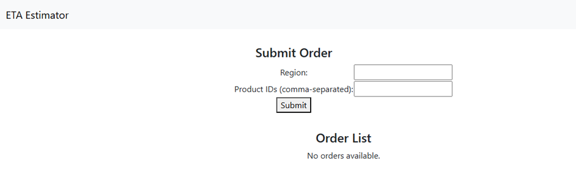
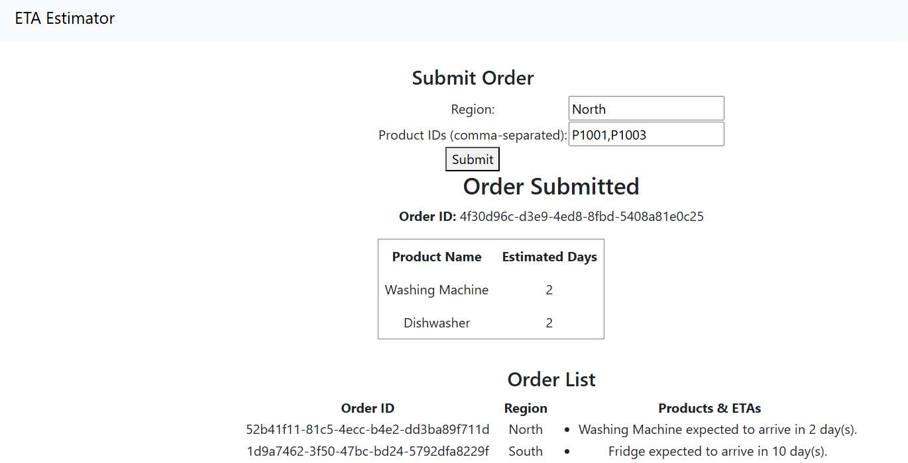
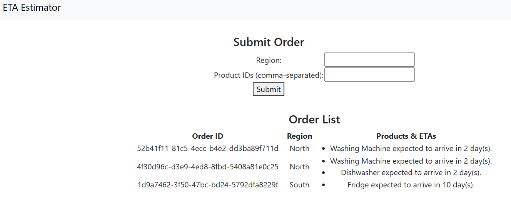

# 📦 Where’s My Order? – ETA Estimator

This project provides a basic delivery ETA estimation tool for appliance orders, with:

- A **C# .NET Web API backend** to manage products, orders, and estimated delivery
- An **Angular frontend** to submit and track orders

## Technologies Used

- **Backend**: ASP.NET Core Web API (.NET 6 or 7)
- **Frontend**: Angular 17+

## ⚙️ Backend Setup (C# Web API)
The project is built using Visual Stusio 2022.
Download the solution and run.

### 📦 API Endpoints Overview

| Method | Endpoint              | Description                       |
|--------|------------------------|-----------------------------------|
| GET    | `/api/orders`         | List all submitted orders         |
| POST   | `/api/orders`         | Submit new order                  |
| DELETE | `/api/orders/{id}`    | Delete an order by ID             |

📌 Orders must include `region` and `productIds`.

## 🌐 Frontend Setup (Angular)
Download the project and in the terminal, navigate to the folder,Eta-Estimator-UI. 
do >npm install  
then >ng serve
# ETA-Estimator
Delivery ETA Estimator
The application has been developed using following data as reference and assumptions and works just to show delivery of orders.Data to be entered is case sensitive currently. 
Products and region delay data are mocked in DataStore.cs
Submitted orders are stored in an in-memory ConcurrentDictionary 
Delivery is estimated based on region and stock available
Estimated delivery days based on:

Region delay (e.g., West = 7 days)

Product availability (in-stock vs out-of-stock delay)

The application comprises of two solutions front end ui in Angular and backend api built using Web API C#.
Initial UI, on running angular application

Add data to the fields in UI as per data stored in backend. 
The backend has data stored as: 
For products –  
ProductId = "P1001", Name = "Washing Machine", InStock = true  
ProductId = "P1002", Name = "Fridge", InStock = false  
ProductId = "P1003", Name = "Dishwasher", InStock = true  
ProductId = "P1004", Name = "Oven", InStock = false  
For products to be delivered in days as per region mentioned, data is as: 
North-> 2, here for North region, number of days to deliver is 2  
 South-> 5, 
East -> 3, 
West-> 7 

On adding data in the text fields and submitting, we get as follows 

On refreshing the page we get page as 

Similarly, we can add data based on data above. 